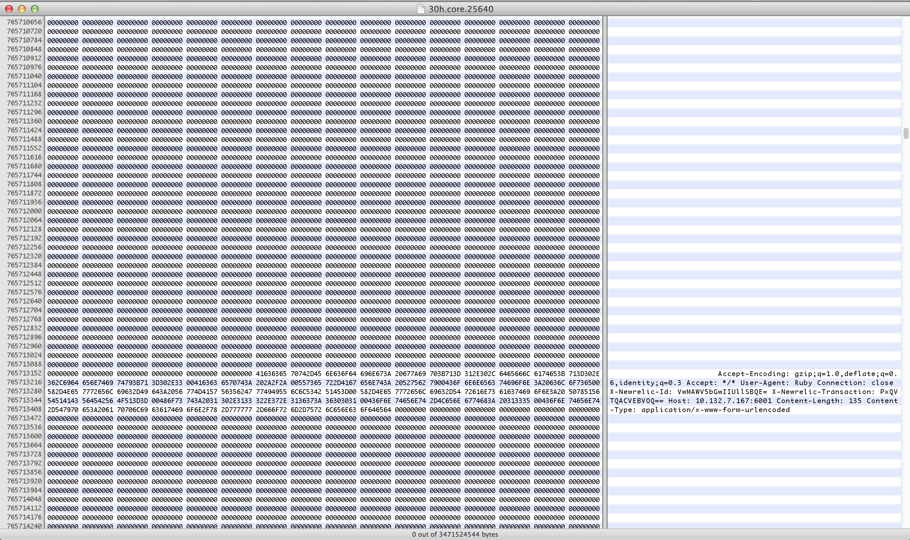
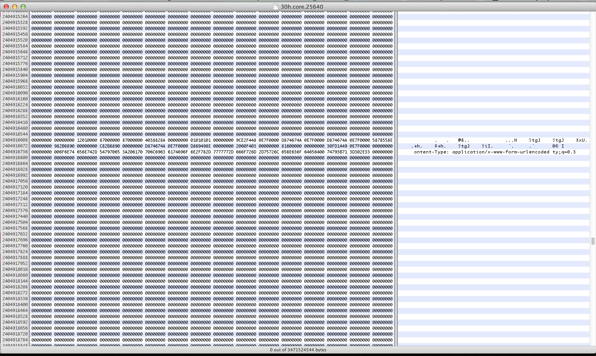

# Rails 快速上手
author
:   潘旻琦(孝达)

allotted-time
:   1h

theme
:   debian

# 日程安排

* Rails 核心技术
* 15 分钟创建博客演示
* 深入学习路线图

# Rails 核心技术

* 模型：Active Record
* 视图：Action View
* 控制器：Action Controller
* 路由：Action Dispatch

# Rails 核心技术

* 辅助：Active Support
* 邮件：Action Mailer
* 前端：sprockets
* 第三方扩展包

# 开始之前的提问时间
* 安装有没有问题？
* 创建项目有没有问题？
* 创建的目录结构看过了吗？

# Active Record

* 对象关系映射
* 数据库迁移
* 数据校验
* 对象生命周期管理
* 对象关联管理
* 数据查询

# 对象关系映射

| 类名  | 表名  |
|---|---|
| Post  | posts  |
| LineItem  | line_items  |
| Mouse  | mice  |
| STD  | 猜一猜 |
| B  | 猜一猜 |
| A::B  | 猜一猜 |

# 对象关系映射

| 类名  | 表名  |
|---|---|
| Post  | posts  |
| LineItem  | line_items  |
| Mouse  | mice  |
| STD  | stds |
| B  | bs |
| A::B  | bs |

# 特殊字段
* id、*_id
* created_at、updated_at
* lock_version
* type、*_type
* *_count
* 保留字（DangerousAttributeError）

# CRUD
* new、create、create!
* all、first、find_by、where
* update、update_all、update_attribute
* destroy、delete

# 数据库迁移

    class CreateProducts < ActiveRecord::Migration
      def change
        create_table :products do |t|
          t.string :name
          t.text :description
 
          t.timestamps
        end
      end
    end
{: lang="ruby"}

# 数据库迁移

    class ChangeProductsPrice < ActiveRecord::Migration
      def up
        change_table :products do |t|
          t.change :price, :string
        end
      end
 
      def down
        change_table :products do |t|
          t.change :price, :integer
        end
      end
    end
{: lang="ruby"}

# 数据库迁移

    $ bin/rails generate migration \
    AddPartNumberToProducts
    
    $ bin/rails generate migration \
    AddPartNumberToProducts part_number:string
    
    $ bin/rails generate migration \
    AddPartNumberToProducts part_number:string:index
    
    $ bin/rake db:rollback
    
    $ bin/rake db:rollback STEP=3
{: lang="bash"}

# 数据库迁移

    create_table(:apples) { |t| }
    add_column :products, :part_number, :string
    add_index :products, :part_number
    
    add_reference :products, :supplier,
          polymorphic: true, index: true
          
    create_join_table :products, :categories,
          table_name: :categorization
{: lang="ruby"}

# 数据校验

    validates :name, presence: true
    validates :password, confirmation: true
    validates :size, inclusion:
              { in: %w(small medium large) }
    validates :name, length: { minimum: 2 }
    validates :email, uniqueness: true
    validates :password, length: { in: 6..20 }
    validates :points, numericality: true
    validates :terms_of_service, acceptance: true
    validates_associated :books
{: lang="ruby"}

# 对象生命周期管理

    class User < ActiveRecord::Base
      validates :login, :email, presence: true

      before_validation :ensure_login_has_a_value

      protected
        def ensure_login_has_a_value
          if login.nil?
            self.login = email unless email.blank?
          end
        end
    end
{: lang="ruby"}

# 对象生命周期管理 (C)

* before_validation
* after_validation
* before_save
* around_save
* before_create
* around_create
* after_create
* after_save

# 对象生命周期管理 (R)

* after_initialize
* after_find

# 对象生命周期管理 (U)

* before_validation
* after_validation
* before_save
* around_save
* before_update
* around_update
* after_update
* after_save

# 对象生命周期管理 (D)

* before_destroy
* around_destroy
* after_destroy

# 对象关联管理

* belongs_to
* has_one
* has_many
* has_many :through
* has_one :through
* has_and_belongs_to_many

# 数据查询

* conjecture: TelePort routers failed to disconnect
* After TelePort routers _physically_ disconnects the server did not got notified
* resources allocated for a single connection persists

# Diagnosis (1st try - seeking proof)

* implemented RFC1122 TCP keepalive with Tianji

        set_sock_opt(Socket::SOL_SOCKET, Socket::SO_KEEPALIVE, true)
        # 这个开启keepalive功能
        
        set_sock_opt(Socket::IPPROTO_TCP, Socket::TCP_KEEPIDLE, 15)
        # 探测发包时间间隔 15s没有数据通讯后，发送第一个keepalive包，注意有些语言中单位是毫秒
        
        set_sock_opt(Socket::IPPROTO_TCP, Socket::TCP_KEEPINTVL, 15)
        # 此后每15s发送一个keepalive包，注意有些语言中单位是毫秒
        
        set_sock_opt(Socket::IPPROTO_TCP, Socket::TCP_KEEPCNT, 4)
        # 当连续4个keepalive包没收到的时候，断开连接      
{: lang="ruby"}

# Diagnosis (1st try - failed)

* same memory usage beahvior kept going

# Diagnosis (2st try)

* Utilize ObjectSpace
* The ObjectSpace module contains a number of routines that interact with the garbage collection facility and allow you to traverse all living objects with an iterator.

# Diagnosis (2st try)

    require 'objspace'
    $time_of_start_of_event_machine = Time.now
    
    ...
    
    EM.add_periodic_timer(5) do
     puts "{{{#{Time.now.to_i - $time_of_start_of_event_machine.to_i}}}}"
     p ObjectSpace.count_objects
     p ObjectSpace.count_objects_size
    end
{: lang="ruby"}

# Diagnosis (2st try - 1min observation)

``{:TOTAL=>535604, :FREE=>82282, :T_OBJECT=>17577, :T_CLASS=>4704, :T_MODULE=>330, :T_FLOAT=>9, :T_STRING=>276773, :T_REGEXP=>825, :T_ARRAY=>55024, :T_HASH=>21509, :T_STRUCT=>512, :T_BIGNUM=>29175, :T_FILE=>5, :T_DATA=>25801, :T_MATCH=>3954, :T_COMPLEX=>1, :T_RATIONAL=>1, :T_NODE=>16701, :T_ICLASS=>421}``

# Diagnosis (2st try - 16min observation)

``{:TOTAL=>532751, :FREE=>1083, :T_OBJECT=>7478, :T_CLASS=>3615, :T_MODULE=>330, :T_FLOAT=>9, :T_STRING=>356241, :T_REGEXP=>905, :T_ARRAY=>48804, :T_HASH=>8944, :T_STRUCT=>1029, :T_BIGNUM=>53974, :T_FILE=>5, :T_DATA=>24972, :T_MATCH=>4195, :T_COMPLEX=>1, :T_RATIONAL=>1, :T_NODE=>20744, :T_ICLASS=>421}``

# Diagnosis (2st try - 42min observation)

``{:TOTAL=>532751, :FREE=>842, :T_OBJECT=>6872, :T_CLASS=>3563, :T_MODULE=>330, :T_FLOAT=>9, :T_STRING=>355374, :T_REGEXP=>883, :T_ARRAY=>48261, :T_HASH=>8822, :T_STRUCT=>1022, :T_BIGNUM=>54875, :T_FILE=>5, :T_DATA=>28706, :T_MATCH=>2964, :T_COMPLEX=>1, :T_RATIONAL=>1, :T_NODE=>19800, :T_ICLASS=>421}``

# Diagnosis (2st try - 1h observation)

``[[String, 54953], [Array, 24254], [RubyVM::InstructionSequence, 9756], [Time, 9076], [Gem::Requirement, 1713], [Class, 1404], [Gem::Dependency, 1151], [Regexp, 801], [Proc, 653], [Hash, 592], [RubyVM::Env, 591], [OpenSSL::Cipher::Cipher, 486], [Module, 330], [Gem::Version, 297], [PhantomLogger, 277], [Bignum, 247], [PhantomParser, 243], [PhantomTcpConnection::EM_CONNECTION_CLASS, 243], [PhantomEncryptor, 243], [Gem::Specification, 196], [Bundler::LazySpecification, 185], [Bundler::Dependency, 176], [Encoding, 100], [Range, 93], [EventMachine::WebSocket::MaskedString, 31], [EventMachine::WebSocket::Connection, 31], [EventMachine::WebSocket::Handler13, 31], [PhantomOnpageWebSocket, 25], [Pathname, 17], [Mutex, 15], [Gem::Platform, 15], [ActiveSupport::Callbacks::CallbackChain, 13], [ActiveModel::AttributeMethods::ClassMethods::AttributeMethodMatcher, 10], [Float, 9], [OptionParser::Switch::NoArgument, 7], [Bundler::Index, 7], [OptionParser::OptionMap, 6], [PhantomWebSocket, 6], [Bundler::Source::Git::GitProxy, 5], [Bundler::Source::Git, 5], [ActiveSupport::Notifications::Fanout::Subscriber, 5], [Method, 5], [Set, 4], [Object, 4], [EventMachine::PeriodicTimer, 4], [IO, 3], [OptionParser::List, 3], [Bundler::SpecSet, 3], [UnboundMethod, 3], [MatchData, 3], [JSON::Ext::Generator::State, 3], [Redis::Connection::TCPSocket, 2], [Thread, 2], [PhantomHttpConnection::EM_CONNECTION_CLASS, 2], [EventMachine::DelegatedHttpResponse, 2], [BigDecimal, 2], [ActiveSupport::Notifications::Fanout, 1], [Arel::Visitors::PostgreSQL, 1], [ActiveRecord::ConnectionAdapters::SchemaCache, 1], [ActiveSupport::Notifications::Instrumenter, 1], [Daemons::PidFile, 1], [URI::Parser, 1], [PG::Connection, 1], [Bundler::SystemRubyVersion, 1], [Bundler::Runtime, 1], [Daemons::Controller, 1], [Bundler::Settings, 1], [Monitor, 1], [Rational, 1], [Gem::StubSpecification, 1], [Bundler::Definition, 1], [OpenSSL::X509::Store, 1], [Daemons::Application, 1], [Resolv, 1], [Resolv::Hosts, 1], [Resolv::DNS, 1], [Resolv::DNS::Config, 1], [Bundler::RubygemsIntegration::Future, 1], [Bundler::CurrentRuby, 1], [ActiveRecord::ConnectionAdapters::PostgreSQLAdapter, 1], [Thread::ConditionVariable, 1], [MonitorMixin::ConditionVariable, 1], [ActiveRecord::ConnectionAdapters::ConnectionPool, 1], [I18n::Config, 1], [Daemons::ApplicationGroup, 1], [Bundler::Source::Rubygems, 1], [OptionParser::CompletingHash, 1], [ActiveRecord::Base::ConnectionSpecification, 1], [URI::HTTP, 1], [Psych::EngineManager, 1], [ActiveModel::MassAssignmentSecurity::LoggerSanitizer, 1], [fatal, 1], [Psych::Handler::DumperOptions, 1], [Data, 1], [Daemons::Optparse, 1], [ARGF.class, 1], [Random, 1], [SystemStackError, 1], [NoMemoryError, 1], [RubyVM, 1], [ActiveSupport::Inflector::Inflections, 1], [OptionParser::Switch::OptionalArgument, 1], [Binding, 1], [IOError, 1], [ThreadGroup, 1], [Complex, 1], [OptionParser::Switch::RequiredArgument, 1], [ActiveRecord::ExplainSubscriber, 1], [Bundler::RubyVersion, 1], [ActiveRecord::LogSubscriber, 1], [ActiveRecord::ConnectionAdapters::ConnectionHandler, 1], [ActiveSupport::Dependencies::ClassCache, 1], [ActiveSupport::Dependencies::WatchStack, 1], [Redis::Client, 1], [Redis, 1], [Logger::LogDevice::LogDeviceMutex, 1], [Logger::LogDevice, 1], [Logger::Formatter, 1], [Logger, 1], [OptionParser, 1], [Process::Status, 1], [Redis::Connection::Ruby, 1], [Redis::FutureNotReady, 1], [ActiveRecord::Relation, 1], [Arel::Table, 1], [ActiveRecord::ConnectionAdapters::PostgreSQLAdapter::StatementPool, 1]]``

# Diagnosis (2st try - 14h observation)

``[[String, 73032], [Array, 40919], [Time, 25410], [RubyVM::InstructionSequence, 9756], [Gem::Requirement, 1713], [Class, 1404], [Gem::Dependency, 1151], [Proc, 1052], [Hash, 984], [Regexp, 801], [RubyVM::Env, 708], [OpenSSL::Cipher::Cipher, 462], [PhantomLogger, 391], [Module, 330], [Gem::Version, 297], [Bignum, 235], [PhantomTcpConnection::EM_CONNECTION_CLASS, 231], [PhantomEncryptor, 231], [PhantomParser, 231], [Gem::Specification, 196], [Bundler::LazySpecification, 185], [Bundler::Dependency, 176], [EventMachine::WebSocket::MaskedString, 159], [EventMachine::WebSocket::Connection, 159], [EventMachine::WebSocket::Handler13, 159], [PhantomOnpageWebSocket, 128], [Encoding, 100], [Range, 93], [PhantomWebSocket, 31], [Pathname, 17], [Gem::Platform, 15], [Mutex, 15], [ActiveSupport::Callbacks::CallbackChain, 13], [ActiveModel::AttributeMethods::ClassMethods::AttributeMethodMatcher, 10], [Float, 9], [OptionParser::Switch::NoArgument, 7], [Bundler::Index, 7], [OptionParser::OptionMap, 6], [Bundler::Source::Git::GitProxy, 5], [Bundler::Source::Git, 5], [ActiveSupport::Notifications::Fanout::Subscriber, 5], [Object, 4], [Set, 4], [Method, 4], [OptionParser::List, 3], [JSON::Ext::Generator::State, 3], [UnboundMethod, 3], [MatchData, 3], [EventMachine::PeriodicTimer, 3], [IO, 3], [Bundler::SpecSet, 3], [BigDecimal, 2], [Thread, 2], [Redis::Connection::TCPSocket, 2], [I18n::Config, 1], [Daemons::PidFile, 1], [Daemons::ApplicationGroup, 1], [ActiveSupport::Inflector::Inflections, 1], [OptionParser::Switch::OptionalArgument, 1], [OptionParser::Switch::RequiredArgument, 1], [OptionParser, 1], [URI::Parser, 1], [Daemons::Optparse, 1], [ActiveSupport::Notifications::Fanout, 1], [Bundler::Settings, 1], [Monitor, 1], [Rational, 1], [Gem::StubSpecification, 1], [Bundler::Definition, 1], [OpenSSL::X509::Store, 1], [Daemons::Controller, 1], [Resolv, 1], [Resolv::Hosts, 1], [Resolv::DNS, 1], [Resolv::DNS::Config, 1], [Bundler::RubygemsIntegration::Future, 1], [Bundler::CurrentRuby, 1], [Arel::Visitors::PostgreSQL, 1], [ActiveRecord::ConnectionAdapters::SchemaCache, 1], [Bundler::Source::Rubygems, 1], [ActiveSupport::Notifications::Instrumenter, 1], [PG::Connection, 1], [URI::HTTP, 1], [Bundler::SystemRubyVersion, 1], [Bundler::Runtime, 1], [ActiveRecord::ConnectionAdapters::PostgreSQLAdapter, 1], [Thread::ConditionVariable, 1], [MonitorMixin::ConditionVariable, 1], [ActiveRecord::ConnectionAdapters::ConnectionPool, 1], [Daemons::Application, 1], [OptionParser::CompletingHash, 1], [ActiveRecord::Base::ConnectionSpecification, 1], [Psych::EngineManager, 1], [ActiveModel::MassAssignmentSecurity::LoggerSanitizer, 1], [fatal, 1], [Psych::Handler::DumperOptions, 1], [Data, 1], [ActiveRecord::ExplainSubscriber, 1], [ARGF.class, 1], [Random, 1], [ActiveRecord::LogSubscriber, 1], [SystemStackError, 1], [NoMemoryError, 1], [RubyVM, 1], [ActiveRecord::ConnectionAdapters::ConnectionHandler, 1], [ActiveSupport::Dependencies::ClassCache, 1], [Binding, 1], [IOError, 1], [ThreadGroup, 1], [Complex, 1], [ActiveSupport::Dependencies::WatchStack, 1], [Redis::Client, 1], [Bundler::RubyVersion, 1], [Redis, 1], [Logger::LogDevice::LogDeviceMutex, 1], [Logger::LogDevice, 1], [Logger::Formatter, 1], [Logger, 1], [Process::Status, 1], [Redis::Connection::Ruby, 1], [Redis::FutureNotReady, 1], [HTTP::Parser, 1], [EventMachine::HttpStubConnection, 1], [EventMachine::HttpConnection, 1], [HttpConnectionOptions, 1], [ActiveRecord::Relation, 1], [Arel::Table, 1], [ActiveRecord::ConnectionAdapters::PostgreSQLAdapter::StatementPool, 1]]``

# Diagnosis (2st try - 30h observation)

``[[String, 87519], [Array, 51226], [Time, 35416], [RubyVM::InstructionSequence, 9756], [Hash, 3121], [Proc, 2757], [Gem::Requirement, 1713], [Class, 1404], [RubyVM::Env, 1268], [Gem::Dependency, 1151], [PhantomLogger, 948], [Regexp, 803], [EventMachine::WebSocket::Connection, 712], [EventMachine::WebSocket::Handler13, 709], [EventMachine::WebSocket::MaskedString, 709], [PhantomOnpageWebSocket, 644], [OpenSSL::Cipher::Cipher, 470], [Module, 330], [Gem::Version, 297], [Bignum, 239], [PhantomTcpConnection::EM_CONNECTION_CLASS, 235], [PhantomEncryptor, 235], [PhantomParser, 235], [Gem::Specification, 196], [Bundler::LazySpecification, 185], [Bundler::Dependency, 176], [Encoding, 100], [Range, 93], [PhantomWebSocket, 68], [Pathname, 17], [Mutex, 15], [Gem::Platform, 15], [ActiveSupport::Callbacks::CallbackChain, 13], [ActiveModel::AttributeMethods::ClassMethods::AttributeMethodMatcher, 10], [Float, 9], [Bundler::Index, 7], [OptionParser::Switch::NoArgument, 7], [OptionParser::OptionMap, 6], [Bundler::Source::Git::GitProxy, 5], [Bundler::Source::Git, 5], [ActiveSupport::Notifications::Fanout::Subscriber, 5], [Method, 4], [Object, 4], [Set, 4], [MatchData, 4], [UnboundMethod, 3], [Bundler::SpecSet, 3], [JSON::Ext::Generator::State, 3], [EventMachine::PeriodicTimer, 3], [OptionParser::List, 3], [EventMachine::WebSocket::Handler76, 3], [IO, 3], [Thread, 2], [Redis::Connection::TCPSocket, 2], [HTTP::Parser, 2], [EventMachine::HttpStubConnection, 2], [EventMachine::HttpConnection, 2], [BigDecimal, 2], [HttpConnectionOptions, 2], [URI::Parser, 1], [Daemons::ApplicationGroup, 1], [Daemons::Application, 1], [Daemons::PidFile, 1], [ActiveSupport::Inflector::Inflections, 1], [OptionParser::Switch::OptionalArgument, 1], [MonitorMixin::ConditionVariable, 1], [ActiveRecord::ConnectionAdapters::ConnectionPool, 1], [I18n::Config, 1], [Bundler::Runtime, 1], [Thread::ConditionVariable, 1], [OptionParser::Switch::RequiredArgument, 1], [ActiveSupport::Notifications::Fanout, 1], [Bundler::Settings, 1], [Monitor, 1], [Rational, 1], [Gem::StubSpecification, 1], [Bundler::Definition, 1], [OpenSSL::X509::Store, 1], [Resolv, 1], [Resolv::Hosts, 1], [Resolv::DNS, 1], [Resolv::DNS::Config, 1], [Bundler::RubygemsIntegration::Future, 1], [Bundler::CurrentRuby, 1], [OptionParser::CompletingHash, 1], [ActiveRecord::Base::ConnectionSpecification, 1], [Bundler::Source::Rubygems, 1], [Psych::EngineManager, 1], [ActiveModel::MassAssignmentSecurity::LoggerSanitizer, 1], [URI::HTTP, 1], [Psych::Handler::DumperOptions, 1], [ActiveRecord::ExplainSubscriber, 1], [ActiveRecord::LogSubscriber, 1], [ActiveRecord::ConnectionAdapters::ConnectionHandler, 1], [ActiveSupport::Dependencies::ClassCache, 1], [ActiveSupport::Dependencies::WatchStack, 1], [Redis::Client, 1], [Redis, 1], [ActiveRecord::ConnectionAdapters::PostgreSQLAdapter, 1], [Logger::LogDevice::LogDeviceMutex, 1], [Logger::LogDevice, 1], [fatal, 1], [Logger::Formatter, 1], [Data, 1], [OptionParser, 1], [ARGF.class, 1], [Random, 1], [Logger, 1], [SystemStackError, 1], [NoMemoryError, 1], [RubyVM, 1], [Daemons::Optparse, 1], [Daemons::Controller, 1], [Binding, 1], [IOError, 1], [ThreadGroup, 1], [Complex, 1], [Process::Status, 1], [Arel::Visitors::PostgreSQL, 1], [Bundler::RubyVersion, 1], [Redis::Connection::Ruby, 1], [Redis::FutureNotReady, 1], [ActiveRecord::Relation, 1], [Arel::Table, 1], [ActiveRecord::ConnectionAdapters::PostgreSQLAdapter::StatementPool, 1], [ActiveRecord::ConnectionAdapters::SchemaCache, 1], [ActiveSupport::Notifications::Instrumenter, 1], [EventMachine::HttpResponseHeader, 1], [PG::Result, 1], [CookieJar::Jar, 1], [EventMachine::HttpClient::CookieJar, 1], [EventMachine::HttpClient, 1], [Addressable::URI, 1], [HttpClientOptions, 1], [PG::Connection, 1], [Bundler::SystemRubyVersion, 1], [PhantomCommand, 1]]``

# Diagnosis (2st try - failed)
* No indication of significant increase in object counts
* No stand-out classes
* The leakage must occured at lib level

# Diagnosis (3st try)
* We let the leakage leak for hours
* When memory got swollen, most of the memory would be filled with leaked content
* We then take a core-dump of the process and analyze

# Diagnosis (3st try)
{:relative_width='99'}

# Diagnosis (3st try)
{:relative_height='128'}

# Diagnosis (3st try)
{:relative_height='128'}

# Diagnosis (3st try)
{:relative_height='128'}

# Diagnosis (3st try)
* could be an allocated buffer string in memory
* could be a struct containing a string

# Diagnosis (3st try)
* List possible libs
  * Ruby 2.1.0 core lib (least possible place to find a memory-leaking bug)
  * eventmachine 1.0.3 core-ext lib (written in C++, released 2 years ago)
  * eventmachine_httpserver 0.2.1 core-ext lib (suspicious, written in C++, released 3 years ago)

# Diagnosis (3st try)
* Analyze stirng content, possible producer of the leaked strings
  * only PhantomHttpConnection
  * which was built upon EM::HttpServer
  * which is defined by eventmachine_httpserver
  
# Diagnosis (3st try)
* Read source code...

# Diagnosis (3st try)
* in http.cpp

        static VALUE t_unbind (VALUE self)
        {
        	RubyHttpConnection_t *hc = (RubyHttpConnection_t*)
            (NUM2LONG (rb_ivar_get (self, Intern_http_conn)));
        	if (hc)
        		delete hc;
        	return Qnil;
        }
{: lang="cpp"}

# Diagnosis (3st try)
* What's ``Intern_http_conn``?
  * in ``static VALUE t_post_init (VALUE self)``
  
    ``RubyHttpConnection_t *hc = new RubyHttpConnection_t (self);``
    
    ``rb_ivar_set (self, Intern_http_conn, LONG2NUM ((long)hc));``
    
# Diagnosis (3st try)
* in our code
    ``module PhantomHttpConnection``

    ``  include EM::HttpServer``

    ``  def unbind``
    
    ``  end``
    
    ``end``
    
# Diagnosis (3st try)
* ``RubyHttpConnection_t`` is not a Ruby object indeed
* ``RubyHttpConnection_t`` will be leaked on Ruby garbage collection

# Treatment
* Just remove the over-rided `unbind` method.

# Treatment (proof of effect)
* 2h uptime: 3.2% [66804 kB]
* No longer leaked.